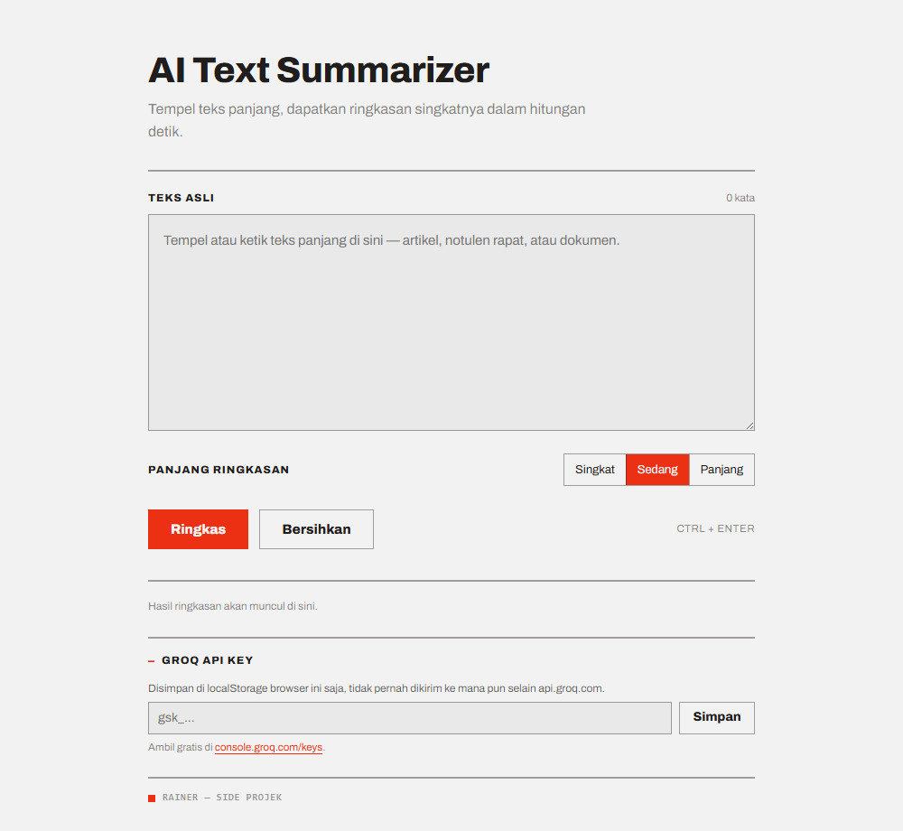

# AI Text Summarizer

Ngebantu mendekin kalimat yang panjang. Tempel teks panjang — artikel, notulen rapat, dokumen — dapat ringkasannya dalam hitungan detik.

HTML + CSS + JavaScript vanilla. Tanpa framework, tanpa backend, tanpa build step. Ringkasan dibuat lewat [Groq API](https://groq.com) dengan model `llama-3.3-70b-versatile`.


<!-- TODO: ganti dengan screenshot asli, simpan di docs/screenshot.png -->

## Fitur

- Textarea untuk paste/tulis teks panjang
- Tombol **Ringkas** (atau `Ctrl` + `Enter`)
- Loading state: progress bar + skeleton
- Area hasil terpisah dari input
- Error handling: teks kosong, key salah, kuota habis, timeout, koneksi putus
- Copy hasil ke clipboard
- Counter jumlah kata sebelum & sesudah, plus persen pemangkasan
- Pilihan panjang ringkasan: singkat / sedang / panjang

## Struktur

```
AI-Text-Summarizer/
├── index.html      # markup + semua state UI
├── style.css       # token & komponen dari design system "Modernist"
├── script.js       # semua logic: state, fetch ke Groq, clipboard, counter
├── .env.example
├── .gitignore
└── README.md
```

## Cara dapat API key Groq (gratis)

1. Buka [console.groq.com](https://console.groq.com) → daftar/masuk (bisa pakai Google atau GitHub).
2. Masuk ke menu **API Keys** → [console.groq.com/keys](https://console.groq.com/keys).
3. Klik **Create API Key**, kasih nama bebas (misal `summarizer-lokal`).
4. **Salin key-nya sekarang juga** — Groq cuma menampilkan sekali. Formatnya `gsk_...`.

Free tier Groq punya limit per menit dan per hari, cukup buat pemakaian pribadi. Kalau kena limit, app menampilkan pesan `RATE_LIMITED`.

## Cara pakai

1. Buka `index.html` — dobel klik saja sudah jalan (`file://` tidak masalah, `fetch` ke Groq tetap bisa).
   Kalau mau pakai live server:
   ```bash
   npx serve .
   ```
   lalu buka alamat yang muncul di terminal.
2. Buka panel **Groq API Key** di bawah halaman, tempel key `gsk_...`, klik **Simpan**.
3. Tempel teks di textarea, pilih panjang ringkasan, klik **Ringkas**.

Key disimpan di `localStorage` browser dan hanya dikirim ke `api.groq.com`. Untuk menghapus: kosongkan field lalu klik **Simpan**.

## Keamanan

Tidak ada key asli yang di-hardcode di `script.js`. `.env` sudah masuk `.gitignore`, dan `.env.example` cuma berisi contoh placeholder.

Satu hal yang perlu disadari: karena app ini static dan memanggil Groq langsung dari browser, key-nya ada di sisi klien. Aman untuk pemakaian lokal/pribadi. **Jangan deploy versi ini ke publik dengan key pribadimu** — siapa pun pengunjung bisa membaca key dari devtools. Kalau mau di-deploy, taruh proxy tipis (Vercel/Cloudflare Function) yang menyimpan key di server dan diteruskan ke Groq.

## Testing

Cek helper (hitung kata & persen pemangkasan):

1. Buka `index.html#selftest`
2. Buka DevTools → Console. Tidak ada `Assertion failed` = lulus.

Cek alur utama secara manual:

| Yang dicoba | Hasil yang diharapkan |
|---|---|
| Klik **Ringkas** dengan textarea kosong | Pesan "Teks masih kosong", border textarea merah |
| Key belum diisi | Panel error `NO_API_KEY`, bagian API key terbuka |
| Key ngasal (`gsk_salah`) | Panel error `INVALID_API_KEY` |
| Teks normal + key valid | Loading → ringkasan + jumlah kata & persen |
| Matikan wifi lalu **Ringkas** | Panel error `NETWORK_ERROR` + tombol "Coba lagi" |
| Klik **Copy** | Tombol berubah jadi "Tersalin" |

## Desain

ngikutin design system **Modernist**: tipografi Archivo, sudut 0px, garis pemisah 2px, aksen merah `#ec3013` khusus untuk aksi utama dan penanda. Satu kolom, lebar maksimal 720px, responsif sampai lebar ponsel.
